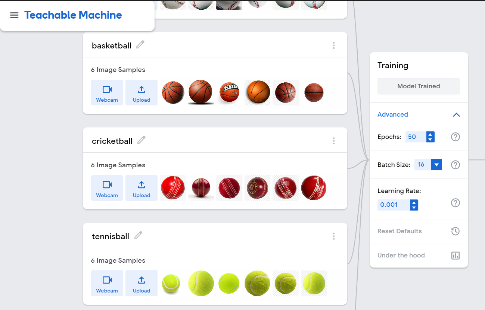

# sample-ai-service
Workflow for cloud-native applications with AI-driven intelligence.

- Leverage transfer learning on teachable-machine **(current)**, lobe.ai, azure custom vision cognitive services, aws sagemaker, etc.
- Import model from above tools and convert to OpenVINO IR 
- OpenVINO Model Server (AI Service) for deploying on cloud or locally on-prem edge device.
- Measure metrics for grpc client microservice for external loadbalancing in the cloud or connecting with other services belonging to an application.

